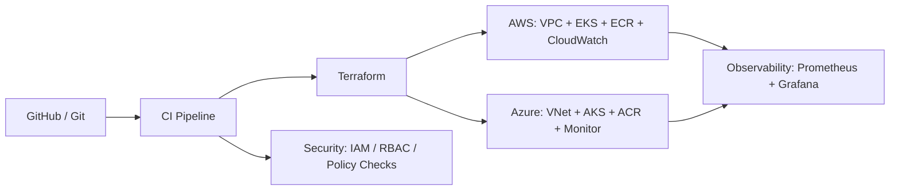

# Architecture Blueprint

## Cloud Split

- **AWS**: primary runtime platform, EKS, IAM, ECR, CloudWatch, VPC
- **Azure**: secondary runtime platform, AKS, Entra ID, ACR, Monitor, VNet
- **Shared**: Terraform, CI/CD, policy checks, observability, secrets, and documentation

## Core Design Principles

- One repo, many environments
- Reusable modules instead of copy-paste configuration
- Clear provider boundaries for each cloud
- Separate platform concerns from application concerns
- Stable promotion path from dev to staging to prod

## Suggested Flow

1. Terraform provisions network and cluster foundations.
2. CI validates formatting, linting, and security checks.
3. Modules deploy Kubernetes platform services.
4. Helm or GitOps deploys applications.
5. Monitoring and logs capture platform health.
6. Policies prevent unsafe changes from reaching production.

## Suggested Platform Diagram

## What Makes It Strong For CV Shortlisting

- Multi-cloud architecture decisions are visible.
- The repo shows modular Terraform thinking.
- The platform includes quality gates and operational tooling.
- The structure is good enough to discuss tradeoffs in interviews.
